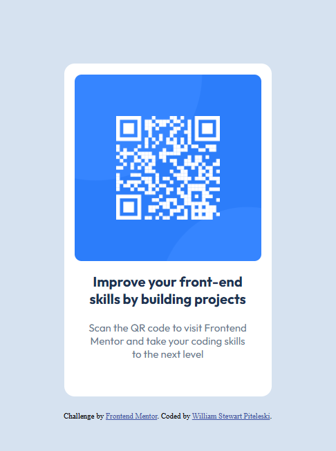

# Frontend Mentor - QR code component solution

This is a solution to the [QR code component challenge on Frontend Mentor](https://www.frontendmentor.io/challenges/qr-code-component-iux_sIO_H). Frontend Mentor challenges help you improve your coding skills by building realistic projects. 

## Table of contents

  - [Screenshot](#screenshot)
- [My process](#my-process)
  - [Built with](#built-with)
  - [What I learned](#what-i-learned)
  - [Continued development](#continued-development)
  - [Useful resources](#useful-resources)
- [Author](#author)
- [Acknowledgments](#acknowledgments)

### Screenshot


## My process

- Study and understand the proposed workflow of the project by:
  - Analyzing the structure of the proposed design
  - Understanding how the design can be achieved in a mobile-first reactive manner 
  - Consider the workflow to achieve the design 
- Develop HTML frame with classes to provide a strong structure to stylize and target 
- Utilize CSS specificity rules to appropriatley target elements for stylizing
- Create a reactive site with the use of relative measurment units
- Clean up redundant code with the use of short hand CSS where applicable

### Built with

- Semantic HTML5 markup
- CSS custom properties
- Flexbox
- Mobile-first workflow

### What I learned

I learned developing a strong semantic HTML base to stylize first. One major component was adding a class to the `<article>` frame I created to allow for specificty in CSS selection.

Once a good frame was built I utilized CSS rules for specificity to target components that required styling. While styling I made a point to use relative measured units to allow for a reactive site that can grow, shrink, and resize based on the screen being used. 

To see how I applied my knowledge, look at the samples below:

```html
<article class="card">
    
    <h2>Improve your front-end skills by building projects</h2>
    <p>Scan the QR code to visit Frontend Mentor and take your coding skills to the next level</p>
  </article>
```
By using the `article` element I was able to avoid the pitfall of using the non-semantic `div`.
Adding a class to the `article` element allowed for more specific targeting for stylization. 

```css
.card{
    width: 300px;
    max-width: 1440px;
    border-radius: 15px;
    background-color: hsl(0, 0%, 100%);
    padding: 1em 0 2em 0;
    margin: 10em auto 0 auto;
}
```
Creating a baseline for all other stylized elements to react off of in a readable, minimal fashion was tough to grasp at first. I had to fully understand how relative units require a baseline to work off of. Using short-hand notation tidies up the code making it more legable for others to understand.

### Continued development

While minimally used in this challenge, I plan to utilize flexbox more in the future to fully grasp its capabilities. I have also learned the need to continue practices with reactive designs for truly acceptable webpages in the future.

Visit my Git Page to see my finished projects, as well as my intended future projects: https://wspiteleski.github.io/Frontend-Mentor-Challenges/

### Useful resources

- [FreeCodeCamp](https://www.freecodecamp.org) - An amazing resource for beginners to get hands on learning with interactive workshops and labs. As I learn concepts here, I begin working with Front End Mentor challenges to ensure I fully grasp what I have learned in an independent environment. 

## Author

- GitHub - [Stew Piteleski](https://github.com/wspiteleski)
- Frontend Mentor - [@wspiteleski](https://www.frontendmentor.io/profile/wspiteleski)

## Acknowledgments

I would like to thank my college professor Mark Dencler, of Harford Community College for introducing me to the concepts of both web development and software development. His teachings began an addictive journey of wanting to excel in this environment. Thank you!
